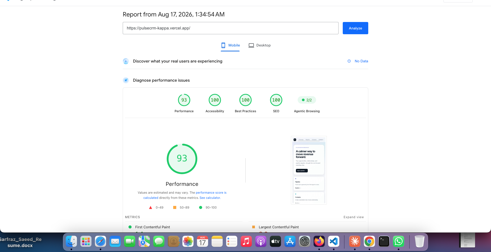
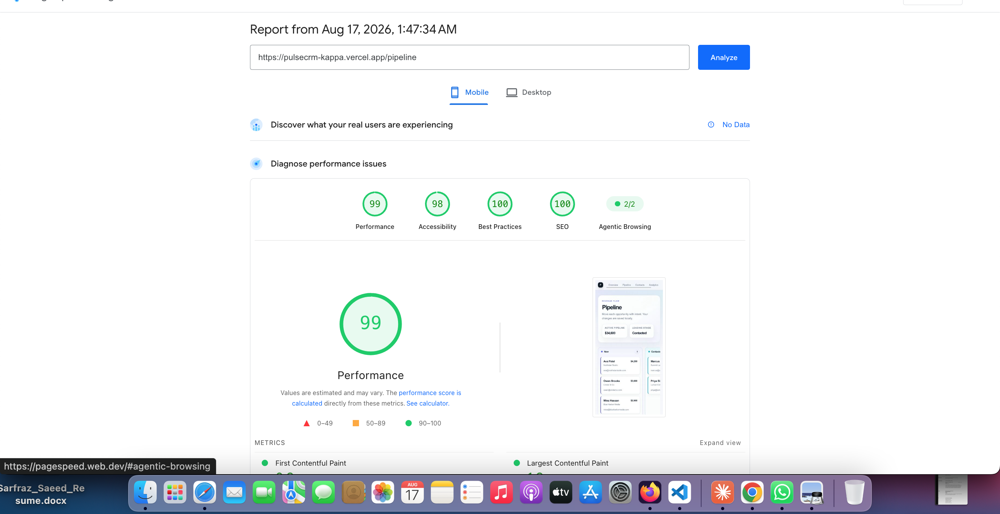
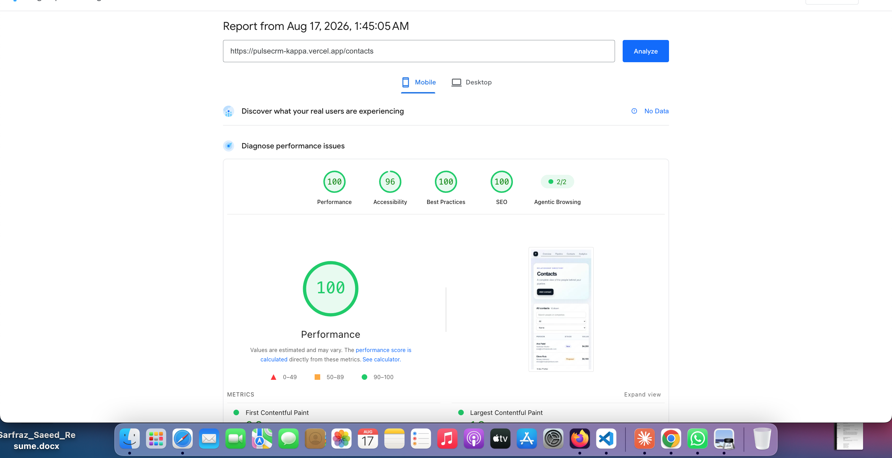

# Accessibility & Performance Audit — PulseCRM

**Pages audited:** `/`, `/contacts`, `/pipeline`
**Tools:** Lighthouse via PageSpeed Insights (mobile), WAVE, manual keyboard-only pass
**Live app:** https://pulsecrm-kappa.vercel.app

## Before

An initial local Lighthouse run (Chrome DevTools) showed a Performance
score of 32 on the homepage. Re-testing in an Incognito window and via
PageSpeed Insights (which runs server-side) showed this was invalidated
by local browser extension interference (Grammarly and others inject
scripts into every page load, which disproportionately affects
Lighthouse's Performance metric) — not a real issue with the app. PSI is
used as the source of truth throughout this audit.

Before the accessibility fixes below, a manual keyboard-only pass found:
- Contact table rows on `/contacts` had no keyboard handler — clicking
  was the only way to open a contact, which also blocked the only path
  to the AI lead-score panel
- The contact detail dialog did not close on Escape and did not manage
  focus on open/close
- The AI lead-score panel's streamed output had no `aria-live` region,
  so screen readers announced nothing as the AI response streamed in
- `useChat`'s `stop` function was never wired up — there was no way to
  interrupt an in-progress AI generation

WAVE error count (before): _fill in after running WAVE_

## Changes made

- `app/contacts/page.tsx`: table rows are now keyboard-operable
  (`tabIndex`, `role="button"`, Enter/Space handler); the detail dialog
  closes on Escape and moves focus to the close button on open
- `app/components/lead-score-panel.tsx`: streamed AI output now sits in
  an `aria-live="polite"` region (`role="log"`); added a
  keyboard-reachable "Stop generating" button wired to `useChat`'s `stop`
- `app/components/lead-score-card.tsx`: the score ring SVG now has an
  accessible name (`role="img"` + `aria-label`) instead of relying on
  visual-only `<text>`

## After

| Page | Performance | Accessibility | Best Practices | SEO |
|---|---|---|---|---|
| `/` | 93 | 100 | 100 | 100 |
| `/pipeline` | 99 | 98 | 100 | 100 |
| `/contacts` | 100 | 96 | 100 | 100 |

WAVE error count (after): _fill in after running WAVE_

**Keyboard-only re-test:** Tab to a contact row → Enter opens the detail
dialog → Tab to "Score with AI" → Enter → Tab to "Stop generating" is
reachable mid-stream → Escape closes the dialog and returns focus.
_Confirm this manually and note the result here._